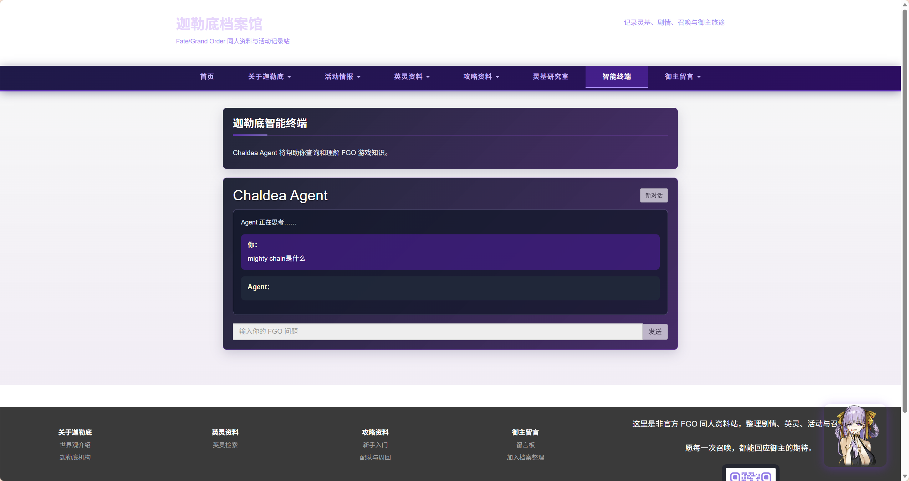
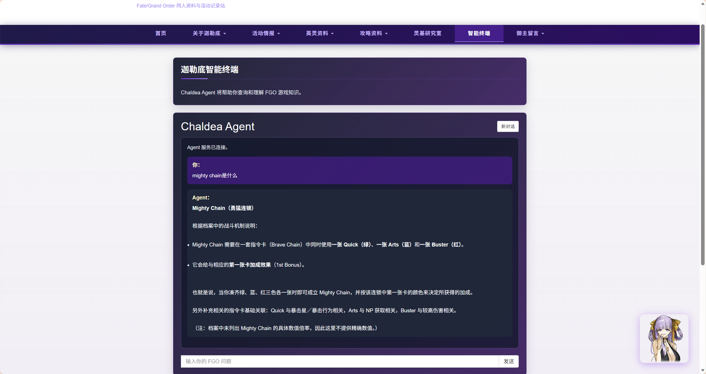

# Chaldea Agent

## Django + Dify FGO Knowledge Agent

这个项目从传统的 FGO 资料网站逐步演进为一个多来源 Knowledge Agent：通过 RAG、结构化工具调用、Web Search 和多轮上下文，为用户提供更适合自然语言交互的知识检索体验。

在线体验： [https://chaldea-archive-v2.onrender.com/agent/](https://chaldea-archive-v2.onrender.com/agent/)

原始 Django Web 项目： [https://github.com/woshilsplbd/fgo-chaldea-archive](https://github.com/woshilsplbd/fgo-chaldea-archive)

## 项目预览



## 技术栈

| 方向 | 技术 |
| --- | --- |
| Backend | Python / Django |
| Agent | Dify / RAG / Query Rewriting / Tool Calling / Memory |
| External capability | Atlas Academy API / Tavily |
| Frontend | HTML / CSS / JavaScript / SSE |
| Engineering | Git / Django tests / Render / Gunicorn / WhiteNoise |

## 项目亮点

- **Multi-source Agent：** 将 Knowledge Retrieval、`lookup_servant`、Tavily Search 和 Memory 组合在同一条 Agent 体验中。
- **Conversation-aware RAG：** 使用 Query Rewriter 将依赖上下文的表达改写为独立检索问题，改善“那它有什么效果？”这类指代查询。
- **Conversation continuity：** 通过 `conversation_id` 和浏览器端 transcript recovery 延续对话体验。
- **Anonymous-user isolation：** 服务端生成匿名身份，并通过签名 HttpOnly Cookie 绑定到独立的 Dify user。
- **Reliability：** 对 stale conversation 状态进行恢复，并隔离内部 Dify payload 与对外响应。
- **Validation：** 当前验证基线为 148 / 148 Django tests passed。

## 系统架构

```text
Browser
  │
  ▼
Django Web / Agent API
  │
  ▼
Dify Chatflow
  ├─ Query Rewriter
  ├─ Knowledge Retrieval / RAG
  ├─ Function Calling Agent
  │    ├─ lookup_servant
  │    └─ Tavily Search
  └─ Memory
```

各来源承担不同职责：

- **RAG：** 检索游戏机制与资料库知识。
- **`lookup_servant`：** 查询结构化的从者信息。
- **Tavily：** 补充近期或具有时效性的 Web 信息。
- **Memory：** 维护多轮对话上下文。

## 解决的工程问题

### Conversation-aware RAG

Agent Memory 能理解上下文，并不代表 Knowledge Retrieval 会自动获得完整检索问题。例如用户说“那它有什么效果？”，如果直接检索，查询本身缺少实体信息。

项目使用 Memory-aware Query Rewriter，在进入 Knowledge Retrieval 前，把当前问题改写为包含必要上下文的 standalone retrieval query。这里关注的是检索链路的职责分离，不对准确率做未经验证的量化承诺。



### Anonymous user isolation

如果所有匿名用户共用一个固定的 Dify user identity，不同用户的对话可能发生混淆。项目采用“服务端生成随机 identity → 签名 HttpOnly Cookie → 独立 Dify user”的链路，为匿名用户提供隔离的会话边界。

### Conversation recovery

浏览器可能在 identity 状态变化后仍保留旧的 `conversation_id`。系统会识别 stale conversation 状态，清除无效的 continuation state，同时保留浏览器中可见的 transcript，并要求后续请求建立干净的新会话。

### SSE transport

Django 使用 `StreamingHttpResponse` 和 SSE event protocol 暴露传输接口，事件类型包括：

```text
start / delta / done / error
```

需要明确的是：SSE transport streaming 已实现，但当前 Dify graph 可能返回完整的最终答案，因此这不等同于真正的 token-level streaming。

## 数据与状态管理

| 数据 | 当前存储位置 |
| --- | --- |
| Visible chat transcript | 浏览器 `localStorage` |
| `conversation_id` | 浏览器 `localStorage` |
| Anonymous identity | 签名 HttpOnly Cookie |
| Conversation state | Dify |
| Site news | Django SQLite（`NewsArticle`） |

当前 Agent chat history 不作为 Django `ChatSession` / `ChatMessage` model 持久化。这是目前的架构边界：浏览器负责可见 transcript，Dify 负责 conversation state，Django 负责 Web/API 编排与站点业务数据。

## 测试

当前验证结果：

```text
148 / 148 Django tests passed
```

此外，项目基线已验证 Django system check、SQLite integrity 和 migrations 状态正常。README 不对测试覆盖率做额外推断。

## 项目结构

```text
apps/                 Django 业务应用与 Agent API
config/               Django settings、URLConf 与 WSGI 配置
evals/                Agent / RAG evaluation cases
knowledge/            FGO 知识库内容
static/               静态资源
templates/             站点基础模板
manage.py              Django 管理入口
requirements.txt       Python 运行依赖
```

## 本地开发

在本仓库根目录执行：

```powershell
python -m venv .venv
.venv\Scripts\activate
pip install -r requirements.txt
python manage.py migrate
python manage.py runserver
```

环境变量示例见 [.env.example](.env.example)。请通过本地 shell 或部署平台注入真实 secret 和 API key，不要将其写入 README 或提交到 Git。

## 环境变量

项目当前使用以下配置项：

| 变量 | 用途 |
| --- | --- |
| `DJANGO_DEBUG` | Django debug 开关 |
| `DJANGO_SECRET_KEY` | Django secret key；生产环境必须提供 |
| `DJANGO_ALLOWED_HOSTS` | 允许的 Host 列表 |
| `DIFY_API_BASE_URL` | Dify API 地址 |
| `DIFY_API_KEY` | Dify API 认证 |
| `DIFY_TIMEOUT_SECONDS` | Dify 请求超时时间 |
| `AGENT_TOOL_API_TOKEN` | Agent tool 的服务间认证 token |
| `RENDER_EXTERNAL_HOSTNAME` | Render 提供的外部 hostname |
| `PYTHON_VERSION` | 部署环境 Python 版本提示 |

## 部署

当前 Render 部署以仓库根目录作为 Django app root：

- Build command：`./build.sh`
- Start command：`gunicorn config.wsgi:application`
- `build.sh` 会安装依赖、运行 `check`、收集静态文件并执行 migrations。
- WhiteNoise 负责静态文件服务。
- 当前部署阶段使用 SQLite 作为临时 fallback；Render 文件系统持久化不是最终生产数据方案，PostgreSQL 与数据迁移属于后续工作。

部署时应在 Render 中配置生产环境变量，尤其是新的 `DJANGO_SECRET_KEY`、`DJANGO_DEBUG=false`、`AGENT_TOOL_API_TOKEN`、`DIFY_API_BASE_URL` 和 `DIFY_API_KEY`。不应复制本地 secret。

## 项目演进

```text
Traditional FGO Web archive
        ↓
Knowledge Agent
        ↓
RAG / Tool Calling
        ↓
Multi-turn conversation
        ↓
Reliability / evaluation
```

这条演进路径体现了项目从内容展示、到知识检索、再到 Agent 编排与可靠性验证的连续工程过程，而不是一次性的 Demo 拼装。

## 当前边界与下一步

- 当前 Dify graph 不保证真正的 token-level streaming，SSE 主要提供统一的事件传输接口。
- Agent chat history 目前由浏览器与 Dify 管理，不写入 Django chat models。
- 生产数据库演进，以及从 SQLite 到 PostgreSQL 的迁移，可以在后续部署阶段单独规划。

<!-- Add current Agent UI screenshots before public GitHub release -->
